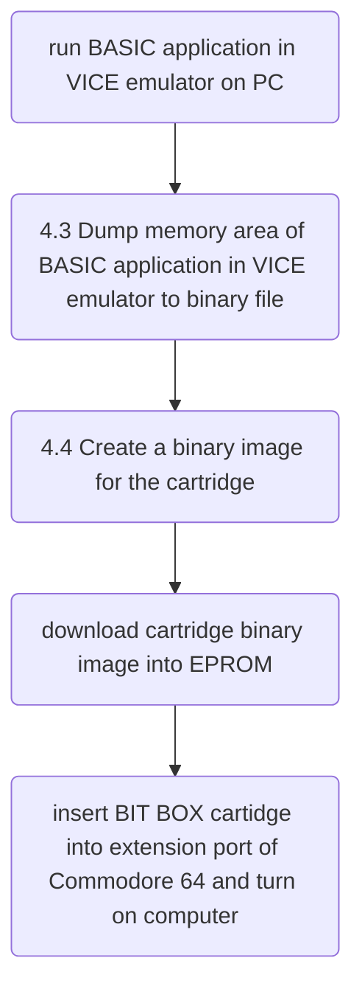
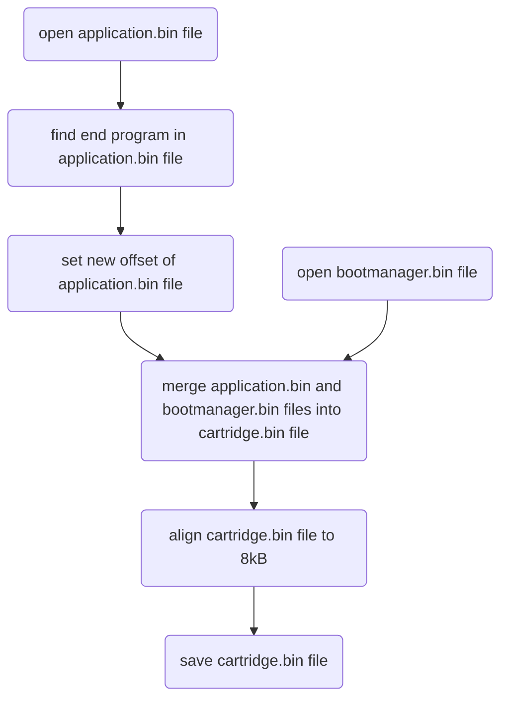

@project **Bit Box**

@author Robert Zdunek

@document revision 0.3 (beta)

@date 13.04.2025
 
# 1. What the Bit Box is?

## 1.1 Overview of the Bit Box project

Bit Box is a [cartridge](https://www.c64-wiki.com/wiki/Cartridge) for Commodore 64 computer. Bit Box was designed in a retro style. It uses old-school components such as EPROM memory and other integrated circuits in THT (Through-Hole Technology) packages. All to get as close as possible to the era of the 80s and 90s. :)

The Bit Box plugs into the [expansion port](https://www.c64-wiki.com/wiki/expansion_port) on the Commodore 64 computer. The cartridge adds additional ROM to the system, in which a computer program is stored. The program runs immediately upon power-up or as soon as the system is reset.

One of the goals of the project is to provide the ability to run custom BASIC applications directly from the catridge. To achieve this goal, a script was written that creates a binary image with the BASIC application that can be downloaded into the catridge's EPROM. For more information go to chapter [4. Create cartridge image](#4-create-cartridge-image), please.

Bit Box supports following EPROM memory types:
- **2764** (8kB)
- **27128** (16kB),
- **27256** (32kB),
- and **27512** (64kB). 

An 8kB or 16kB of the cartridge's ROM can be connected to the Commodore 64 address space. To handle higher-capacity EPROMs, a memory [bank switching](https://www.c64-wiki.com/wiki/Bank_Switching)  mechanism is use. Bit Box supports following baking switching modes:
- **software control** - mode in which selection of the current memory bank is done by software.
- **manual control** - mode in which selection of the current memory  bank is done manually, by the dipswitch.

Chapter [2. Hardware](#2-hardware) describes theory of operation of the Bit Box cartridge. Chapter [3. Dipswitch setting](#3-dipswitch-setting) describes ways to configure Bit Box cartidge. Chapter [4. Create cartridge image](#4-create-cartridge-image) is a guide on how to prepare a binary image with a BASIC application.

## 1.2 Contents of the repository 

- \doc
	- img\
		- **bit_box_logo.jpg**
		- **bit_box_pict1.jpg**
		- **bit_box_pict2.jpg**
		- **bit_box_pict3.jpg**
- \hardware
	- **bit_box_pcb.pdf** - PCB layout
	- **bit_box_sch.pdf** - schematic diagram
	- **bit_box_v10_gerber.zip** - gerber files 
- \software
	- \bitbox_cartridge_image_creator
		- **application.bin** - BASIC application image example 
		- **bootmanager.bin** - bootmanager image 
		- **cartridge.bin** - cartridge image (application + bootmanager images)
		- **cartridge.crt** - cartridge image for VICE emulator
		- **createCartridgeImage.bat** - launcher of Python script
		- **createCartridgeImage.py** - Python script to create image for Bit Box cartridge
		- **createCartridgeImageForVICE.bat** - launcher of VICE application to create cartridge image for VICE emulator

## 1.3 Bit Box photos

  

# 2. Hardware

to be done :)

# 3. Dipswitch setting

## 3.1 Glossary

- **software control** - mode in which selection of the current memory bank is done by software.
- **manual control** - mode in which selection of the current memory  bank is done manually, by setting dipswitch.
- **8kB bank mode** - mode in which the Commodore 64 can address 8kB area of the catridge.
- **16kB bank mode** - mode in which the Commodore 64 can address 16kB area of the catridge.

## 3.2 Dipswitch overview

The **Bit Box** has 7 dipswitches for setting the operating mode or memory type:

1. **ENABLE LATCH** - enable U2 74LS272 latch. When switch is set to ${\color{red}ON}$ then latch can be controlled by software. 
2. **/ROML -> A13** - When switch is set to ${\color{red}ON}$ then /ROML line controls the A13 input of the U1 EPROM. /ROML line addresses the first or last 8kB area of the EPROM in mode 16kB bank mode. The dipswitch should be set to ${\color{red}ON}$ to activate 16kB bank mode. When this dipswitch is set to ON, then 8th dipswitch should be set to OFF state. 
3. **/ROMH -> EPROM_OE** When switch is set ${\color{red}ON}$ then signal on /ROMH line enables EPROM outputs, as the signal on /ROML line does. Otherwise, only line /ROML can enable EPROM memory outputs. The dipswitch should be set to ${\color{red}ON}$ to activate 16kB bank mode.
4. **Q7 -> /GAME** When switch is set ${\color{red}ON}$ then signal on Q7 line of the latch controls /GAME and /EXROM lines. Otherwise only /EXROM line is controled and /GAME is to logical 1 state. The dipswitch should be set to ${\color{red}ON}$ to activate 16kB bank mode.
5. not used
6. **Q2 -> A15** When switch is set ${\color{red}ON}$ then signal on Q2 line of the latch controls A15 address line of the EPROM memory. Otherwise A15 address line of the EPROM is to logical 1 state.
7. **Q1 -> A14** When switch is set ${\color{red}ON}$ then signal on Q1 line of the latch controls A14 address line of the EPROM memory. Otherwise A14 address line of the EPROM is to logical 1 state.
8. **Q0 -> A13** When switch is set ${\color{red}ON}$ then signal on Q0 line of the latch controls A13 address line of the EPROM memory. Otherwise A13 address line of the EPROM is to logical 1 state. When 2th dipswitch is set to ON (16kB bank mode is activated), then this dipswitch should be set to OFF state.

Sections 3.3, 3.4, 3.5 and 3.6 describe how to set the dipswitch for different types of modes and different types of memory.

## 3.3 Software control, 8kB bank mode
| U1 | 1 | 2 | 3 | 4 | 5 | 6 | 7 | 8 |
| - | - | - | - | - | - | - | - | - |
| | 0->`Latch_EN` | `/ROML` -> `A13`  | `/ROMH` -> `EPROM_OE` | `Q7` -> `/GAME` | | `Q2` -> `A15` | `Q1` -> `A14` | `Q0` -> `A13` |
| 2764 | ${\color{red}ON}$ | OFF | OFF | OFF |  | OFF | OFF | OFF |
| 27128 | ${\color{red}ON}$ | OFF | OFF | OFF |  | OFF | OFF | ${\color{red}ON}$ |
| 27256 | ${\color{red}ON}$ | OFF | OFF | OFF |  | OFF | ${\color{red}ON}$ | ${\color{red}ON}$ |
| 27512 | ${\color{red}ON}$ | OFF | OFF | OFF |  | ${\color{red}ON}$ | ${\color{red}ON}$ | ${\color{red}ON}$ |

**Table 3.1:** Dipswitch configuration for 8kB bank mode and software bank selection

## 3.4 Software control, 16kB bank mode
| U1 | 1 | 2 | 3 | 4 | 5 | 6 | 7 | 8 |
| - | - | - | - | - | - | - | - | - |
| | 0->`Latch_EN` | `/ROML` -> `A13`  | `/ROMH` -> `EPROM_OE` | `Q7` -> `/GAME` | | `Q2` -> `A15` | `Q1` -> `A14` | `Q0` -> `A13` |
| 27128 | ${\color{red}ON}$ | ${\color{red}ON}$| ${\color{red}ON}$| ${\color{red}ON}$|  | OFF | OFF | OFF |
| 27256 | ${\color{red}ON}$ | ${\color{red}ON}$| ${\color{red}ON}$ | ${\color{red}ON}$|  | OFF | ${\color{red}ON}$ | OFF |
| 27512 | ${\color{red}ON}$ | ${\color{red}ON}$| ${\color{red}ON}$ | ${\color{red}ON}$|  | ${\color{red}ON}$ | ${\color{red}ON}$ | OFF |

**Table 3.2:** Dipswitch configuration for 16kB bank mode and software bank selection 

## 3.5 Manual control, 8kB bank mode
| U1 | 1 | 2 | 3 | 4 | 5 | 6 | 7 | 8 |
| - | - | - | - | - | - | - | - | - |
| | 0->`Latch_EN` | `/ROML` -> `A13`  | `/ROMH` -> `EPROM_OE` | `Q7` -> `/GAME` | | `Q2` -> `A15` | `Q1` -> `A14` | `Q0` -> `A13` |
| 2764 | OFF | OFF | OFF | OFF |  | OFF | OFF | OFF |
| 27128 | OFF | OFF | OFF | OFF |  | OFF | OFF | [table 3.5](#352-bank-selection-in-8kB-mode-for-27128) |
| 27256 | OFF | OFF | OFF | OFF |  | OFF | [table 3.6](#353-bank-selection-in-8kB-mode-for-27256) | [table 3.6](#353-bank-selection-in-8kB-mode-for-27256) |
| 27512 | OFF | OFF | OFF | OFF |  | [table 3.7](#354-bank-selection-in-8kB-mode-for-27512) | [table 3.7](#354-bank-selection-in-8kB-mode-for-27512) | [table 3.7](#354-bank-selection-in-8kB-mode-for-27512) |

**Table 3.3:** Dipswitch configuration for 8kB bank mode and manual bank selection 

### 3.5.1 bank selection in 8kB mode for 2764
| EPROM bank | EPROM address area | 6| 7 | 8 |
| - | - | - | - | - |
| | |`Q2` -> `A15` | `Q1` -> `A14` | `Q0` -> `A13` |
| 0 | 0x0000 - 0x1FFF | OFF | OFF  | OFF | 

**Table 3.4:** Manual bank selection in 8kB bank mode for 2764 memory 

### 3.5.2 bank selection in 8kB mode for 27128
| EPROM bank | EPROM address area | 6| 7 | 8 |
| - | - | - | - | - |
| | |`Q2` -> `A15` | `Q1` -> `A14` | `Q0` -> `A13` |
| 0 | 0x0000 - 0x1FFF | OFF | OFF  | ${\color{red}ON}$ | 
| 1 | 0x2000 - 0x3FFF | OFF | OFF  | OFF |

**Table 3.5:** Manual bank selection in 8kB bank mode for 27128 memory 

### 3.5.3 bank selection in 8kB mode for 27256
| EPROM bank | EPROM address area | 6| 7 | 8 |
| - | - | - | - | - |
| | |`Q2` -> `A15` | `Q1` -> `A14` | `Q0` -> `A13` |
| 0 | 0x0000 - 0x1FFF | OFF | ${\color{red}ON}$ | ${\color{red}ON}$ | 
| 1 | 0x2000 - 0x3FFF | OFF | ${\color{red}ON}$ | OFF |
| 2 | 0x4000 - 0x5FFF | OFF | OFF | ${\color{red}ON}$ |
| 3 | 0x6000 - 0x7FFF | OFF | OFF | OFF |

**Table 3.6:** Manual bank selection in 8kB bank mode for 27256 memory 

### 3.5.4 bank selection in 8kB mode for 27512
| EPROM bank | EPROM address area | 6| 7 | 8 |
| - | - | - | - | - |
| | |`Q2` -> `A15` | `Q1` -> `A14` | `Q0` -> `A13` |
| 0 | 0x0000 - 0x1FFF | ${\color{red}ON}$ | ${\color{red}ON}$ | ${\color{red}ON}$ | 
| 1 | 0x2000 - 0x3FFF | ${\color{red}ON}$ | ${\color{red}ON}$ | OFF |
| 2 | 0x4000 - 0x5FFF | ${\color{red}ON}$ | OFF | ${\color{red}ON}$ |
| 3 | 0x6000 - 0x7FFF | ${\color{red}ON}$ | OFF | OFF |
| 4 | 0x8000 - 0x9FFF |OFF | ${\color{red}ON}$ | ${\color{red}ON}$ |
| 5 | 0xA000 - 0xBFFF |OFF | ${\color{red}ON}$ | OFF |
| 6 | 0xC000 - 0xDFFF |OFF | OFF | ${\color{red}ON}$ |
| 7 | 0xE000 - 0xFFFF |OFF | OFF | OFF |

**Table 3.7:** Manual bank selection in 8kB bank mode for 27512 memory 

## 3.6 manual control, 16kB bank mode
| U1 | 1 | 2 | 3 | 4 | 5 | 6 | 7 | 8 |
| - | - | - | - | - | - | - | - | - |
| | 0->`Latch_EN` | `/ROML` -> `A13`  | `/ROMH` -> `EPROM_OE` | `Q7` -> `/GAME` | | `Q2` -> `A15` | `Q1` -> `A14` | `Q0` -> `A13` |
| 27128 | OFF  | ${\color{red}ON}$ | ${\color{red}ON}$| ${\color{red}ON}$|  | OFF | OFF | OFF |
| 27256 | OFF | ${\color{red}ON}$ | ${\color{red}ON}$ | ${\color{red}ON}$|  | OFF | [table 3.10](#362-bank-selection-in-16kB-mode-for-27256) | OFF |
| 27512 | OFF | ${\color{red}ON}$ | ${\color{red}ON}$ | ${\color{red}ON}$|  | [table 3.11](#363-bank-selection-in-16kB-mode-for-27512) | [table 3.11](#363-bank-selection-in-16kB-mode-for-27512) | OFF |

**Table 3.8:** Dipswitch configuration for 16kB bank mode and manual bank selection

### 3.6.1 bank selection in 16kB mode for 27128
| EPROM bank | EPROM address area | 6| 7 | 8 |
| - | - | - | - | - |
| | |`Q2` -> `A15` | `Q1` -> `A14` | `Q0` -> `A13` |
| 0 | 0x0000 - 0x3FFF | OFF | OFF  | OFF | 

**Table 3.9:** Manual bank selection in 16kB bank mode for 27128 memory 

### 3.6.2 bank selection in 16kB mode for 27256
| EPROM bank | EPROM address area | 6| 7 | 8 |
| - | - | - | - | - |
| | |`Q2` -> `A15` | `Q1` -> `A14` | `Q0` -> `A13` |
| 0 | 0x0000 - 0x3FFF | OFF | ${\color{red}ON}$| OFF | 
| 1 | 0x4000 - 0x7FFF | OFF | OFF  | OFF |

**Table 3.10:** Manual bank selection in 16kB bank mode for 27256 memory 

### 3.6.3 bank selection in 16kB mode for 27512
| EPROM bank | EPROM address area | 6| 7 | 8 |
| - | - | - | - | - |
| | |`Q2` -> `A15` | `Q1` -> `A14` | `Q0` -> `A13` |
| 0 | 0x0000 - 0x3FFF | ${\color{red}ON}$ | ${\color{red}ON}$| OFF | 
| 1 | 0x4000 - 0x7FFF | ${\color{red}ON}$ | OFF  | OFF |
| 2 | 0x8000 - 0xBFFF | OFF  | ${\color{red}ON}$| OFF  |
| 3 | 0xC000 - 0xFFFF | OFF  | OFF | OFF |

**Table 3.11:** Manual bank selection in 16kB bank mode for 27512 memory 


# 4. Create cartridge image

## 4.1 Glossary 

- **bootmanager image** - binary file that contains signature and performs RESET rutine (basic initialization of the VIC, CIA and RAM.
- **application image** - binary file with BASIC application.
- **cartridge image** - output binary file that should be downloaded in EPROM memory. The cartridge image is a combination of the bootmanager image and the processed application image
- **VICE emulator** -VICE is an open source Commodore 64 emulator, https://vice-emu.sourceforge.io/ 

## 4.2 General idea

To create a binary cartridge image, follow these steps.



## 4.3 Dump memory area of BASIC application in VICE emulator to binary file

To get binary image of the BASIC application, first we have to dump memory. This can be done in the VICE emulator. VICE emulator has a complete built-in monitor, which can be used to dump memory and save to the file. When application is loaded into VICE emulator, then in a built-in monitor we can type **bsave** command. The command save the memory from address1 to address2 to the specified file.
```
bsave "<filename>" <device> <address1> <address2>
```
Beginning of BASIC area starts at address 0x0801. **Bit Box** support only less than 8kB images size for BASIC applications, so last data of BASIC application should not be placed above 0x2800 address. However, the bootmanager, added to the cartridge image application, takes 67 bytes. So we need to dump the address area between 0x0801 and 0x27BC.
```
bsave "../../bitbox/application.bin" 0 801 27BC
```

## 4.4 Create a binary image for the cartridge
To create catridge image, python script has been developed. Python script processes application image and marge it with bootmanager image into cartridge image.

```
python createCartridgeImage.py -b "bootmanager.bin" -a "application.bin" -c "cartridge.bin"
```
Python script is located in *software\bitbox_cartridge_image_creator* folder. Bootmanager.bin file is located in the *software\bitbox_cartridge_image_creator* folder
Python script first open application image. Then it find end of the application and cut rest of the binary image. The new BASIC application offset is then set. The BASIC application starts at address 0x0801, but the base address of the cartridge is 0x8000. Therefore, the application image must be processed to work properly. Processed application image and bootmanager image are merge into cartidge image. In final, image cartridge is align to 8kB. Image cartridge is ready to be downloaded into EPROM memory.


## 4.5 Files

All files used in this chapter can be found here:

- \software
	- \bitbox_cartridge_image_creator
		- **application.bin** - BASIC application image example 
		- **bootmanager.bin** - bootmanager image 
		- **cartridge.bin** - cartridge image (application + bootmanager images)
		- **cartridge.crt** - cartridge image for VICE emulator
		- **createCartridgeImage.bat** - launcher of Python script
		- **createCartridgeImage.py** - Python script to create image for Bit Box cartridge
		- **createCartridgeImageForVICE.bat** - launcher of VICE application to create cartridge image for VICE emulator

# 5. Software control mode

## 5.1 Glossary

- **software control** - mode in which selection of the current memory bank is done by software.
- **8kB bank mode** - mode in which the Commodore 64 can address 8kB area of the catridge.
- **16kB bank mode** - mode in which the Commodore 64 can address 16kB area of the catridge.

## 5.1 Software control mode overview

In software control mode, you can select a memory bank, lock the possibility of changes or disable the cartridge.  Changes are made by changing the state of the U2 latch. U2 latch outputs can be changed by POKEing address 56832 (0xDE00).

```
POKE 56832, x
```

U2 latch outputs and functions:

| U2 latch output | x value | function |
| - | - | - |
| Q0 | 1 | bank switching feature, A13 address line in 8kB bank mode only |
| Q1 | 2 | bank switching feature, A14 address line in 8kB and 16kB bank modes |
| Q2 | 4 | bank switching feature, A15 address line in 8kB and 16kB bank modes |
| Q3 | 8 | not connected |
| Q4 | 16 | not connected  |
| Q5 | 32 | not connected  |
| Q6 | 64 | latch lock feature, 0 (default) latch is enable, 1 - latch is disable |
| Q7 | 128 | cartridge disable lock feature, 0 (default) cartridge is enable, 1 - cartdridge is disable |

**Table 5.1:** latch outputs and functions

The all latch outputs are set to 0 after power on or hard reset. 

## 5.2 Bank switching

Memory bank can be switched ([bank switching](https://www.c64-wiki.com/wiki/Bank_Switching)) by setting Q0, Q1 and Q2 latch output. This can be done by the follwoing command:  

```
POKE 56832, x
```

where *x* has values from 0 to 7 for 8kB bank mode or  0, 2, 4, 6 values for 16kB bank mode.

Table 5.1 and Table 5.2 show the possible values of x and the corresponding EPROM memory bank.

| x value | EPROM bank | EPROM address area | EPROM chip type |
| - | - | - | - |
| 0 | 0 | 0x0000 - 0x1FFF | 2764, 27128, 27256, 27512 | 
| 1 | 1 | 0x2000 - 0x3FFF | 27128, 27256, 27512 |
| 2 | 2 | 0x4000 - 0x5FFF | 27256, 27512 |
| 3 | 3 | 0x6000 - 0x7FFF | 27256, 27512 |
| 4 | 4 | 0x8000 - 0x9FFF | 27512  |
| 5 | 5 | 0xA000 - 0xBFFF | 27512 |
| 6 | 6 | 0xC000 - 0xDFFF | 27512 |
| 7 | 7 | 0xE000 - 0xFFFF | 27512 |

**Table 5.2:** bank switching in 8kB bank mode 

| x value | EPROM bank | EPROM address area | EPROM chip type |
| - | - | - | - |
| 0 | 0 | 0x0000 - 0x3FFF | 27128, 27256, 27512 | 
| 2 | 1 | 0x4000 - 0x7FFF | 27256, 27512 |
| 4 | 2 | 0x8000 - 0xBFFF | 27512 |
| 6 | 3 | 0xC000 - 0xFFFF | 27512 |

**Table 5.3:** bank switching in 16kB bank mode 

## 5.3 Lock latch

The latch is activate by default after power on or hard reset. But it can be locked to protect the state of the outputs against unintentional change. Q6 output have to set to 1 to lock the latch.

```
POKE 56832, 64 + x
```

where *x* has values from 0 to 7 for 8kB bank mode or  0, 2, 4, 6 values for 16kB bank mode.

## 5.4 Disable cartridge

The cartridge is activate by default after power on or hard reset. However, it can be turned off to boot the system normally after soft reset. Q7 output have to set to 1 to disable cartridge.

```
POKE 56832, 128 + x
```

where *x* has values from 0 to 7 for 8kB bank mode or  0, 2, 4, 6 values for 16kB bank mode.

# 6. References

to be done :)
